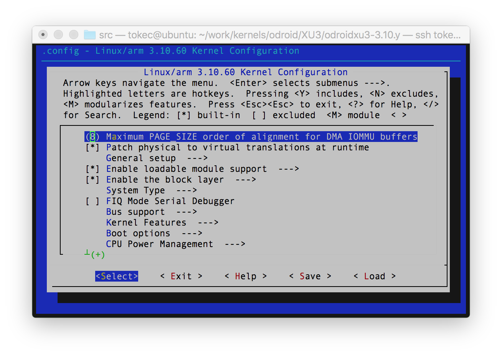

## Compile Kernel of ODROID-XU3
The released version of Odroid-XU3 is v3.10.60+. This section describes how to set up kernel configuration, compile, and install it. The basic step to kernel compile is as follows:
1. Set Environments
2. Kernel Configuration
3. Building Kernel
4. Building Modules
5. Install Kernel and Modules


####1. Set Environments
Envrionment $CPUNUM is the number of CPU cores, which imporves the performance to compile by dividing compile tasks into $CPUNUM core, respectively. The built kernel image will be running on CPU of a target board, where $TARGET_CPU means the type of CPU of a target board, such as, arm, powerpc, x86, etc. Finally, $PREFIX_BINUTILS means the prefix of cross-compile-binutils including full pathname. For instance, thoses environments are given as:
```sh
$ export CPUNUM=$(grep processor /proc/cpuinfo | sort -u | wc -l)
$ export TARET_CPU=arm
$ export PREFIX_BINUTILS=/usr/bin/arm-linux-gnueabi-
```

####2. Kernel Config
Configuration of kernel is saved in .config and default kernel configuration of each board is located in ./arch/$TARGET_CPU/$board_defconfig. ex., The default config of Odroid-XU3 is ./arch/arm/odroidxu3_defconfig. The following command shows GUI config for kernel.
```sh
$ make menuconfig [ARCH=$TARGET_CPU [$CPU_DEFCONFIG]]
```
<center></center>

####3. Building Kernel
```sh
$ make -j$CPUNUM [ARCH=$TARGET_CPU CROSS_COMPILE=$PREFIX-BINUTILS]
```

####4. Building Modules
```sh
$ make -j$CPUNUM modules [ARCH=$TARGET_CPU CROSS_COMPILE=$PREFIX-BINUTILS]
```

####5. Install Kernel and Modules

#####5.1 Install zImage & DTB files
```sh
$ sudo cp arch/$TARGET_CPU/boot/zImage /media/boot
$ sudo cp arch/$TARGET_CPU/boot/dts/exynos5422-odroidxu3.dtb /media/boot
$ sudo sync
```

#####5.2 Install modules
```sh
$ sudo make -j$CPUNUM modules_install [ARCH=$CPU INSTALL_MOD_PATH=$MOD_PATH]
```

#####5.3 Copy .config to /boot for initramfs creation:
```sh
$ sudo cp .config /boot/config-`make kernelrelease`
```

#####5.4 Create initsramfs:
```sh
$ sudo update-initramfs -c -k `make kernelrelease`
```

#####5.5 Create uInitrd:
```sh
$ sudo mkimage -A arm -O linux -T ramdisk -C none -a 0 -e 0 -n uInitrd -d /boot/initrd.img-`make kernelrelease` /boot/uInitrd-`make kernelrelease`
```

#####5.6 Install new uInitrd
```sh
$ sudo cp /boot/uInitrd-`make kerenelrelease` /media/boot/uInitrd
```

#####5.7 Reboot
```sh
$ sudo sync && reboot
```


####Reference
[1] "xu3_building_kernel," http://odroid.com/dokuwiki/doku.php?id=en:xu3_building_kernel
